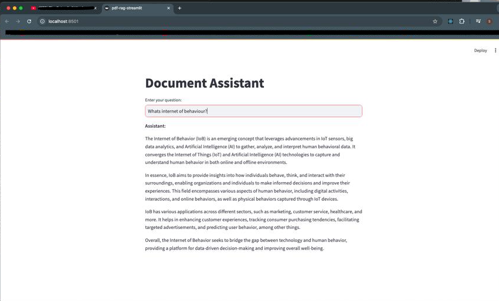
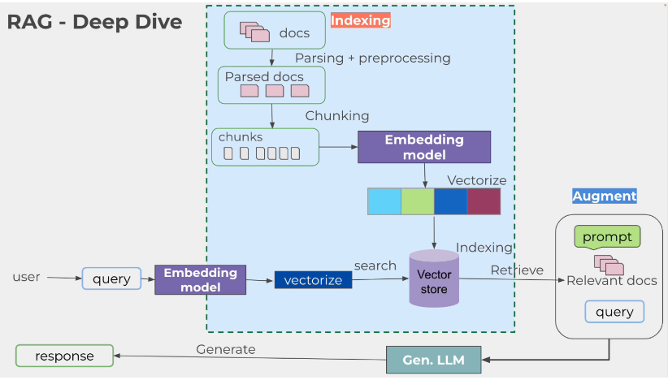

# Sistema RAG para Procesamiento de Documentos PDF

## Descripción
Este proyecto implementa un sistema RAG (Retrieval-Augmented Generation) para procesar y consultar documentos PDF de manera inteligente. El sistema permite cargar documentos PDF, procesarlos y realizar consultas contextuales sobre su contenido.

## Ejemplo de interacción


## Arquitectura del Sistema


El sistema se compone de tres elementos principales:
1. **Documento Fuente**: Ubicado en `data/Articulo.pdf`
2. **Motor RAG**: Implementado en `pdf-rag.py`
3. **Interfaz de Usuario**: Desarrollada con Streamlit en `pdf-rag-streamlit.py`

### Flujo de Funcionamiento
1. **Ingesta de Documentos**:
   - El sistema carga el PDF desde la carpeta `data`
   - El documento se divide en chunks (fragmentos) manejables
   - Se generan embeddings para cada fragmento

2. **Procesamiento de Consultas**:
   - El usuario ingresa una pregunta a través de la interfaz
   - El sistema busca los fragmentos más relevantes
   - Se genera una respuesta contextual utilizando el contenido recuperado

3. **Presentación de Resultados**:
   - La interfaz muestra la respuesta generada
   - Se pueden visualizar los fragmentos relevantes utilizados

## Requisitos
- Python 3.8+
- Streamlit
- LangChain
- PyPDF2
- Otras dependencias (especificadas en requirements.txt)

## Instalación

## Uso
1. Ejecutar la interfaz web:

```bash
streamlit run pdf-rag-streamlit.py
```

2. Acceder a través del navegador:
   - La interfaz estará disponible en `http://localhost:8501`
   - Ingresar consultas relacionadas con el contenido del PDF

## Estructura del Proyecto
```
.
├── data/
│   └── Articulo.pdf
├── img/
│   └── RAGSystem.png
├── pdf-rag.py
├── pdf-rag-streamlit.py
└── README.md
```

## Notas Importantes
- El sistema está optimizado para procesar el documento específico en `data/Articulo.pdf`
- La calidad de las respuestas depende de la relevancia de los fragmentos recuperados
- Se recomienda realizar preguntas específicas y claras para obtener mejores resultados

## Contribuciones
Las contribuciones son bienvenidas. Por favor, asegúrate de:
1. Hacer fork del repositorio
2. Crear una rama para tu feature
3. Enviar un pull request con tus cambios

## Créditos
Este proyecto está basado en los conocimientos adquiridos en los siguientes recursos educativos:

### Curso de Udemy
- [Master Ollama & Python](https://www.udemy.com/course/master-ollama-python/)
- Instructor: Paulo Dichone

### Recursos Adicionales
- [Tutorial de YouTube sobre Ollama](https://www.youtube.com/watch?v=GWB9ApTPTv4)

## Agradecimientos
Agradecemos a los creadores de los cursos y recursos mencionados por proporcionar el conocimiento base para desarrollar este sistema RAG.
